# Operationalizing Machine Learning in Azure

This submission is part of the Udacity Azure Machine Learing Nanodegree. In the first part we use the Auto ML in the Azure Machine Learning Workspace to train a model on the Bankmarketing Dataset.
After that we deployed the trained model and consume it. 
In the second part we create, publish and consume a pipeline that also includes the AutoMl functionalities.

## Architectural Diagram

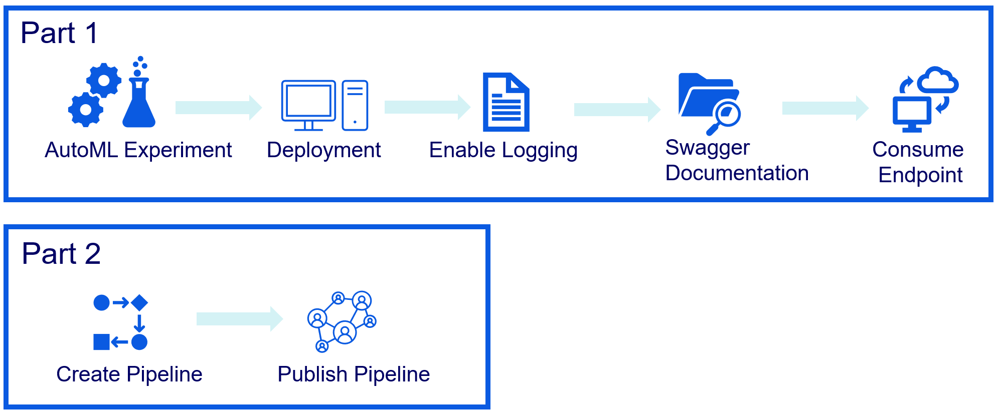

Part 1:

1. **AutoML Experiment**: As a first step, we create an AutoML experiment. Thereby we configure a compute cluster and the dataset we want to run our experiment on.
2. **Model Deployment**: Deploying the best Model will allow us to interact with the HTTP API service and interact with the model by sending data over POST requests.
3. **Enable Logging**: Logging helps us to monitor the model in production. This includes the number of requests it gets, the time each request takes, etc.
4. **Swagger Documentation**: We apply swagger to document the endpoint input and output.
5. **Consume Model Endpoint**: In the last step we interact with the endpoint using some test data.

Part2: 

1. **Create Pipeline**: We further automate the process above by applying a Azure Ml Pipeline wiht the Python SDK.
2. **Publish Pipeline**: Afterwards, we publish the pipeline.

## Key Steps

##Part 1:

##1 Registered Dataset 

In the first step we uploaded and registered the Bank Marketing dataset:

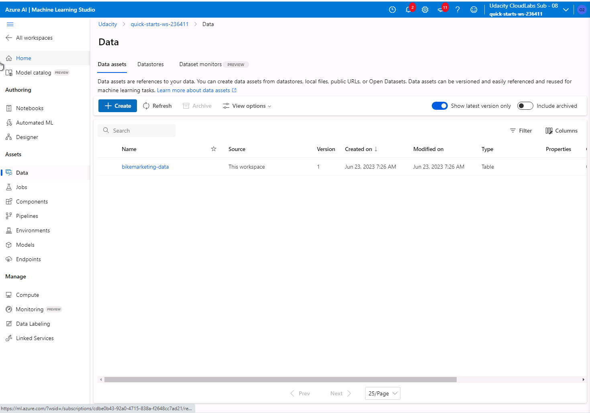

##2 Create AutoML Experiment 

In the next step, we created an Azure AutoML model using the registered bank marketing dataset. Thereby, we created a compute cluster
to run various models using different algorithms within the AutoML experiment.

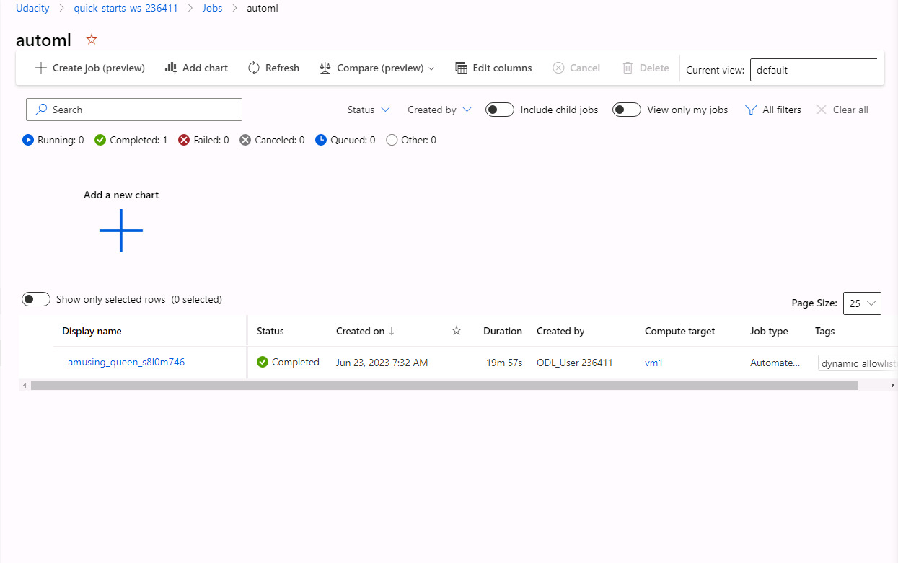

##3 Best performing run

The best resulting run was a VotingEnsemble, which reached a weighted AUC of 94.77%. We subsequently deployed this model.

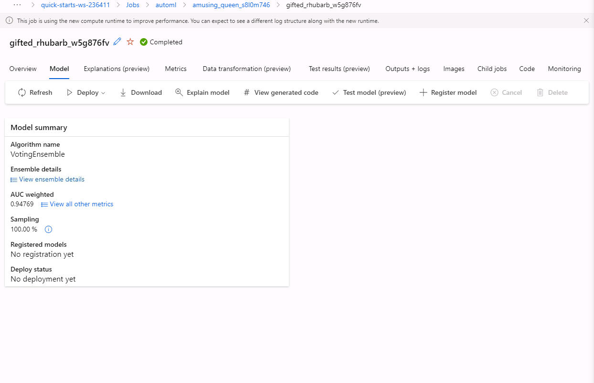

##4 Enable application insights

In order to enable logging, we downloaded the configuration file from Azure workspace, added it to the current working directory 
and set service.update(enable_app_insights=True) in the logs.py file to enable application insights. After that we ran the 
logs.py in the shell:

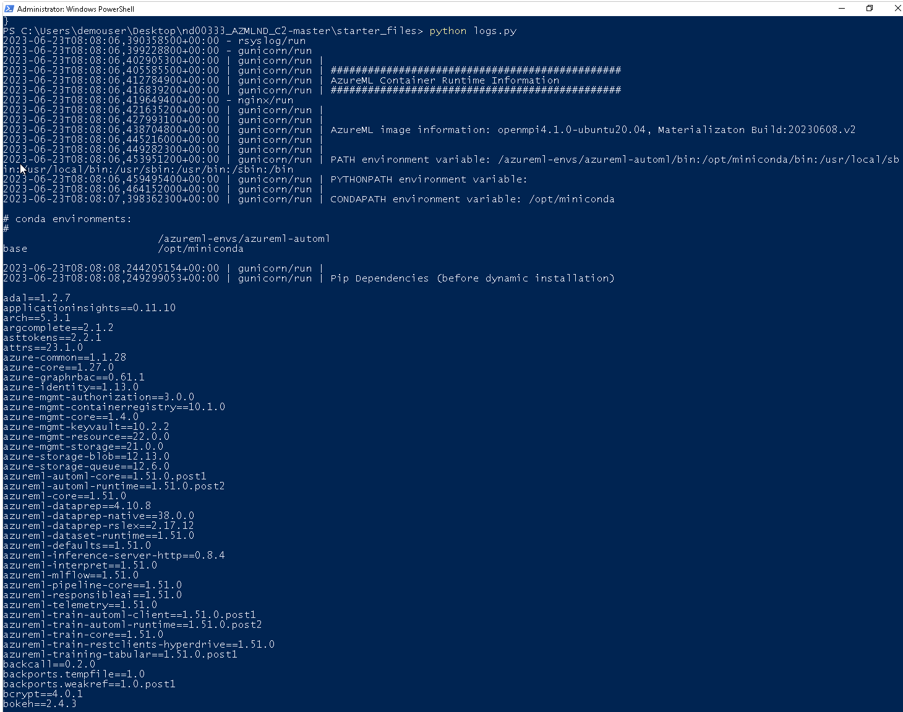

After that, we were able to monitor the Application Insigts in the Azure ML Studio:

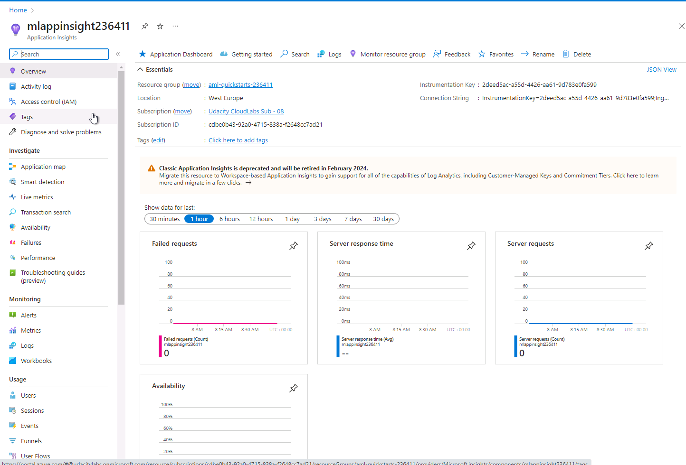

##5 Configure Swagger Docs

In the next step, we configured the swagger docs. Thereby we installed swagger by adapting the port number in the bash 
script. After that we ran the script and entered the localhost:

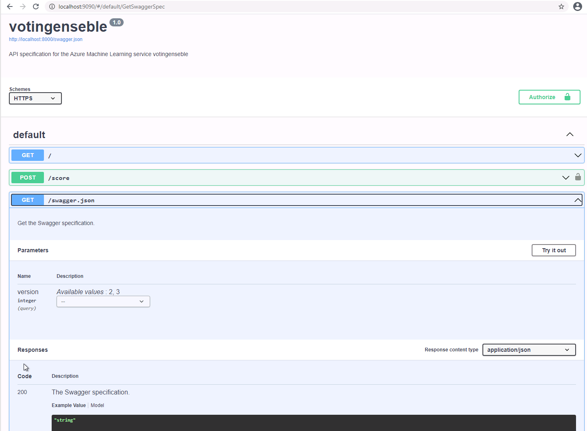

Then we started the server by running serve.py file in order to get insights into our project's swagger.json file.

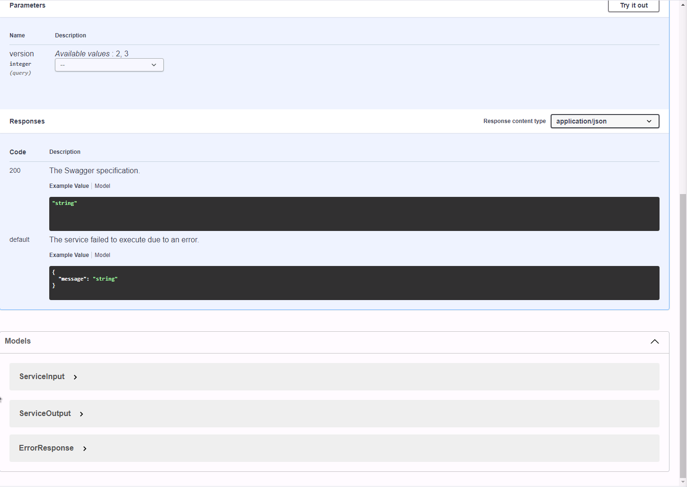

##6 Consuming the deployed Endpoint

After deploying the best model, we can consume it by calling the endpoint. To do so, we need to adapt the endpoint uri 
and the key from the deployed model consume section in the endpoints.py and run the latter file:

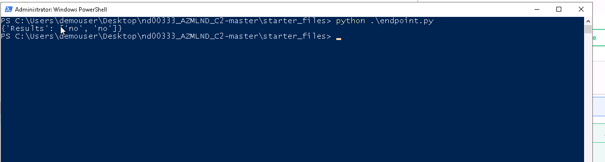

##Part 2:

##7 Create, deploy and consume a Pipeline

To create and deploy the pipleine, we uploaded the sample notebook, made required changes and subsequently ran 
the notebook. After the deployement we were able to consume the pipeline endpoint.

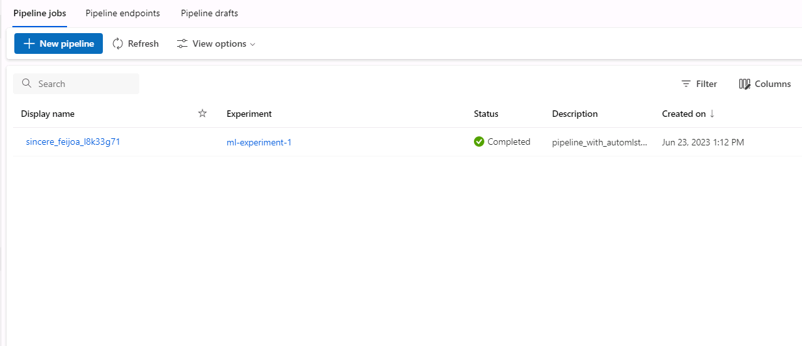

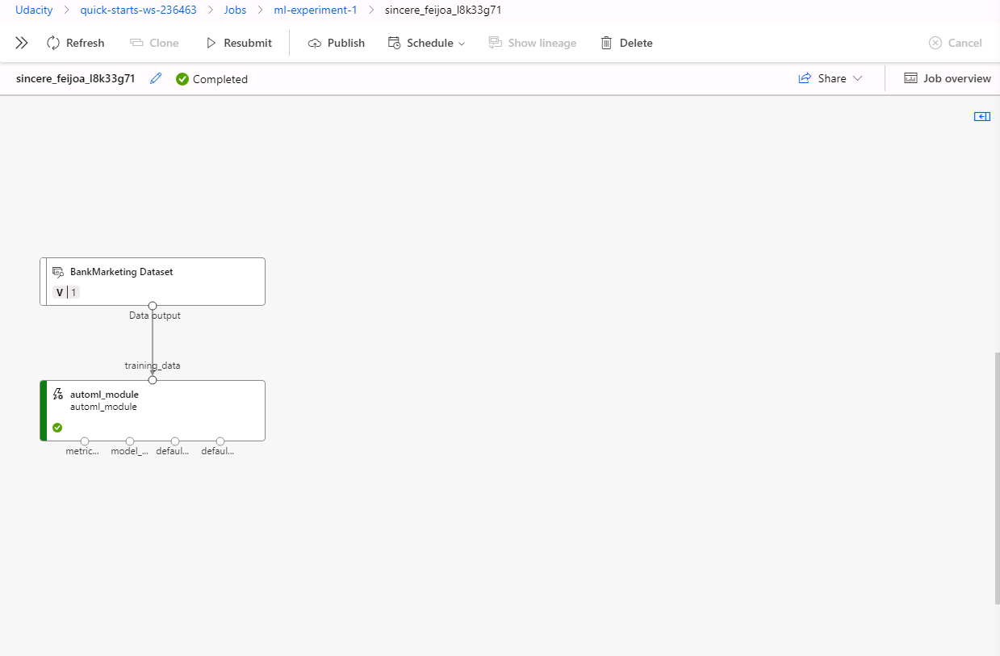

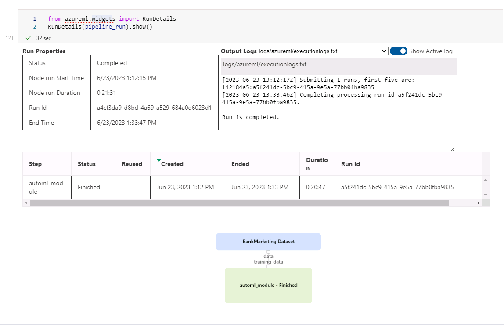

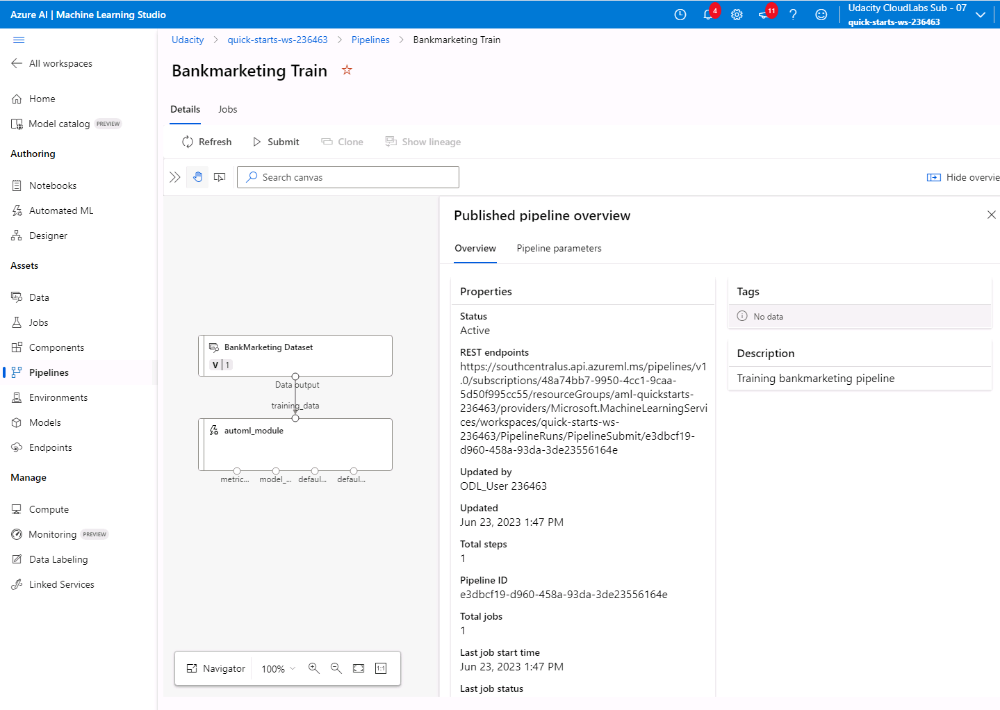

## Screen Recording

You can find a live demo of my project in my [OneDrive](https://1drv.ms/v/s!Amadz-FCI1m3g_EKPMVwMkIkahg6kw?e=y42d5l).

## Future Work

This project can be improved with the following ideas:

- Using the Apache Benachmark tool to gain insight into measures of benchmark performance (f.e. average runtime)
- Applying parallel run step in the pipeline to accelerate the training
- Test a local container with the deployed model